Overview:   
* Produces summarized data by year (ending in '_a') and quarter (ending in '_q') 
* Reads data from delivered data files (rivers, hydrology) and ordination (plankton, hard-bottom, soft-bottom)   
* Data produced are written to Data_produced (starting with '05_') for later use   
* No need to add ordination "data" (ie., scores), they are already at annual level 

## 0. Libraries

```r
library(tidyverse)
```

```
## -- Attaching packages ------------------------------------------------------------------------------------------ tidyverse 1.2.1 --
```

```
## v ggplot2 2.2.1     v purrr   0.2.4
## v tibble  1.4.2     v dplyr   0.7.6
## v tidyr   0.8.1     v stringr 1.3.1
## v readr   1.1.1     v forcats 0.3.0
```

```
## -- Conflicts --------------------------------------------------------------------------------------------- tidyverse_conflicts() --
## x dplyr::filter() masks stats::filter()
## x dplyr::lag()    masks stats::lag()
```

```r
library(readxl)
library(broom)
library(lubridate)
```

```
## 
## Attaching package: 'lubridate'
```

```
## The following object is masked from 'package:base':
## 
##     date
```

```r
# library(pander)
```

## 1. Folders and files    
Content of folders (see code)  

```r
dir("Datasett")
```

```
## [1] "Bløtbunn"              "Eksempel datafil.xlsx" "hardbunn_kopi"        
## [4] "hydrografi"            "Plankton"              "River data (from OKA)"
```

```r
dir("Datasett/River data (from OKA)")
```

```
## [1] "Annual mean flows"                   
## [2] "Concentrations (individual samples)" 
## [3] "Monthly flow-weighted concentrations"
## [4] "Monthly loads"
```

```r
dir("Datasett/hydrografi")
```

```
## [1] "Arendal_allvars_1990_2016.csv"   "Arendal_allvars_1990_2016.Rdata"
## [3] "R scripts"                       "Rådata"
```

```r
dir("Datasett/Bløtbunn")
```

```
## [1] "Beskrivelse av bløtbunndata.docx"                   
## [2] "Klimaoverblikk bløtbunn_data til Helene og Dag.xlsx"
```

```r
dir("Datasett/hardbunn_kopi")
```

```
## [1] "HBanalysesett.csv" "other docs"        "r workspace"
```

```r
dir("Datasett/Plankton")
```

```
## [1] "Beskrivelse av planktondata.docx" "Planteplankton Arendal.xlsx"
```

## 2. River data   
Content of folders (see code)

```r
dir("Datasett/River data (from OKA)/Annual mean flows")
```

```
## [1] "Mean annual flow.xlsx"
```

```r
dir("Datasett/River data (from OKA)/Monthly loads")
```

```
## [1] "Gjerstadelva_Nidelva_monthly loads.xlsx"
## [2] "RIDx5_monthly loads.xlsx"               
## [3] "Storelva_monthly loads.xlsx"
```

```r
dir("Datasett/River data (from OKA)/Concentrations (individual samples)")
```

```
## [1] "Gjerstadelva_Nidelva_conc.xlsx" "RIDx5_conc.xlsx"               
## [3] "Storelva_conc.xlsx"
```

```r
dir("Datasett/River data (from OKA)/Monthly flow-weighted concentrations")
```

```
## [1] "Gjerstadelva_Nidelva_flow-weighted mean_month.xlsx"
## [2] "RIDx5_flow-weighted mean_month.xlsx"               
## [3] "Storelva_flow-weighted mean_month.xlsx"
```

### a. Data of monthly river loads and total discharge  

```r
df1 <- read_excel("Datasett/River data (from OKA)/Monthly loads/Storelva_monthly loads.xlsx")  
df2 <- read_excel("Datasett/River data (from OKA)/Monthly loads/Gjerstadelva_Nidelva_monthly loads.xlsx")  
df3 <- read_excel("Datasett/River data (from OKA)/Monthly loads/RIDx5_monthly loads.xlsx")  

# head(df1, 3)
# head(df2, 3)
# head(df3, 3)

# colnames(df1) %>% dput()
# colnames(df2) %>% dput()
# colnames(df3) %>% dput()   RID rivers also include PO4, SiO2 and SPM

df_rivers <- bind_rows(df1[-1,], df2[-1,], df3[-1,])

# colnames(df_rivers) %>% dput()
vars <- c("TrspTot TOTN", "TrspTot NO3-N", "TrspTot NH4-N", "TrspTot TOTP",           
          "TrspTot TOC", "TrspTot ALK", "TrspTot Ca", "DisTot")
for (var in vars)
  df_rivers[[var]] <- as.numeric(df_rivers[[var]])
df_rivers$Time <- with(df_rivers, lubridate::ymd(paste(Year, Month, "15")))

# Add "_" in column names (TrspTot Ca -> TrspTot_Ca)
colnames(df_rivers) <- sub(" ", "_", colnames(df_rivers), fixed = TRUE)

# Table of available data for each river
tb <- df_rivers %>% 
  gather("Variable", Value, TrspTot_TOTN:DisTot) %>%
  filter(!is.na(Value)) %>%
  xtabs(~Station_name + Variable, .)
tb
```

```
##                                 Variable
## Station_name                     DisTot TrspTot_ALK TrspTot_Ca
##   Drammenselva                      324           0          0
##   Glomma ved Sarpsfoss              324           0          0
##   Nidelva ovenf. Rygene             324         311        311
##   Numedalslågen                     324           0          0
##   Otra                              324           0          0
##   Skienselva                        324           0          0
##   Storelva v/ Nes verk              312         232        276
##   Søndeledelva v. Søndeleddammen    324         324        324
##                                 Variable
## Station_name                     TrspTot_NH4-N TrspTot_NO3-N TrspTot_TOC
##   Drammenselva                             299           324         303
##   Glomma ved Sarpsfoss                     299           324         324
##   Nidelva ovenf. Rygene                     17           311         311
##   Numedalslågen                            300           324         304
##   Otra                                     300           324         303
##   Skienselva                               299           324         303
##   Storelva v/ Nes verk                      17           276         276
##   Søndeledelva v. Søndeleddammen           324           324         324
##                                 Variable
## Station_name                     TrspTot_TOTN TrspTot_TOTP
##   Drammenselva                            324          324
##   Glomma ved Sarpsfoss                    324          324
##   Nidelva ovenf. Rygene                   311          271
##   Numedalslågen                           324          324
##   Otra                                    324          324
##   Skienselva                              324          324
##   Storelva v/ Nes verk                    276          275
##   Søndeledelva v. Søndeleddammen          324          227
```

### b. Local rivers, plot monthly mean discharge by station

```r
gg <- df_rivers %>%
  filter(substr(Station_name, 1, 4) %in% c("Nide","Sønd","Stor")) %>%
  group_by(Station_name, Month) %>%
  summarise(Mean = mean(DisTot, na.rm = TRUE), 
            Q10 = quantile(DisTot, 0.1, na.rm = TRUE), 
            Q90 = max(DisTot, 0.9, na.rm = TRUE)) %>%
  ggplot(., aes(Month, Mean)) + 
    geom_ribbon(aes(ymin = Q10, ymax = Q90), fill = "lightgreen") +
    geom_line() + geom_point() +
    facet_wrap(~Station_name)
gg
```

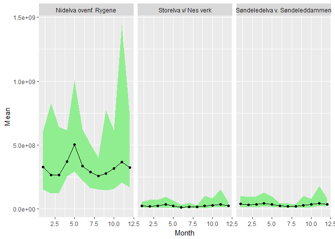<!-- -->

```r
# gg + scale_y_log10()
```

### c. Distant rivers, plot monthly mean discharge by station  
Including Otra

```r
gg <- df_rivers %>%
  filter(!substr(Station_name, 1, 4) %in% c("Nide","Sønd","Stor")) %>%
  group_by(Station_name, Month) %>%
  summarise(Mean = mean(DisTot, na.rm = TRUE), 
            Q10 = quantile(DisTot, 0.1, na.rm = TRUE), 
            Q90 = max(DisTot, 0.9, na.rm = TRUE)) %>%
  ggplot(., aes(Month, Mean)) + 
    geom_ribbon(aes(ymin = Q10, ymax = Q90), fill = "lightgreen") +
    geom_line() + geom_point() +
    facet_wrap(~Station_name)
gg
```

<!-- -->

```r
# gg + scale_y_log10()
```

### d. Summarize by "local rivers"/"distant rivers"    
    * Data ending with _a = annual, ending in _q = quarter
    * Exclude Otra  
    

```r
df <- df_rivers %>%
  filter(!Station_name %in% "Otra") %>%
  mutate(River_type = 
           ifelse(substr(Station_name, 1, 4) %in% c("Nide","Sønd","Stor"), "Local", "Distant"))

df_rivers_summ_a <- df %>% 
  group_by(River_type, Year) %>%
  summarise_at(c("TrspTot_TOTN", "TrspTot_NO3-N", "TrspTot_TOTP", "TrspTot_TOC", "DisTot"), sum, na.rm = TRUE)

df_rivers_summ_q <- df %>%
  mutate(Quarter = case_when(
    Month %in% 1:3 ~ 1,
    Month %in% 4:6 ~ 2,
    Month %in% 7:9 ~ 3,
    Month %in% 10:12 ~ 4
  )) %>%
  group_by(River_type, Year, Quarter) %>%
  summarise_at(c("TrspTot_TOTN", "TrspTot_NO3-N", "TrspTot_TOTP", "TrspTot_TOC", "DisTot"), sum, na.rm = TRUE)
```

### e1. Plot annual data  
Also testing out plotting moving average using tidyquant::geom_ma  

```r
# library(zoo)
# install.packages("tidyquant")
library(tidyquant)
```

```
## Loading required package: PerformanceAnalytics
```

```
## Loading required package: xts
```

```
## Loading required package: zoo
```

```
## 
## Attaching package: 'zoo'
```

```
## The following objects are masked from 'package:base':
## 
##     as.Date, as.Date.numeric
```

```
## 
## Attaching package: 'xts'
```

```
## The following objects are masked from 'package:dplyr':
## 
##     first, last
```

```
## 
## Attaching package: 'PerformanceAnalytics'
```

```
## The following object is masked from 'package:graphics':
## 
##     legend
```

```
## Loading required package: quantmod
```

```
## Loading required package: TTR
```

```
## Version 0.4-0 included new data defaults. See ?getSymbols.
```

```r
ggplot(df_rivers_summ_a, aes(Year, DisTot/1E6, color = River_type)) +
  geom_ma(ma_fun = SMA, n = 5, linetype = 1, size = 1) +
  geom_point() + 
  facet_grid(River_type~., scales = "free_y", labeller = label_both)
```

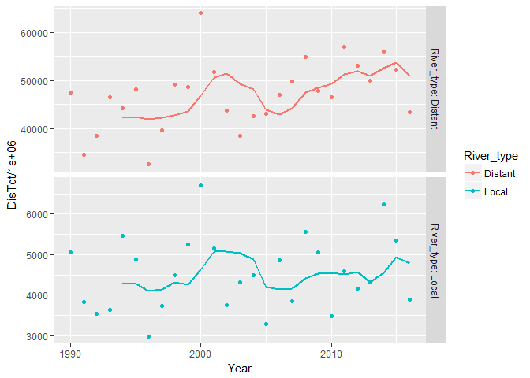<!-- -->

### e2. Plot quarterly data

```r
ggplot(df_rivers_summ_q, aes(Year, DisTot/1E6, color = River_type)) +
  geom_smooth() +
  geom_point() + 
  facet_grid(River_type~Quarter, scales = "free_y", labeller = label_both)
```

```
## `geom_smooth()` using method = 'loess'
```

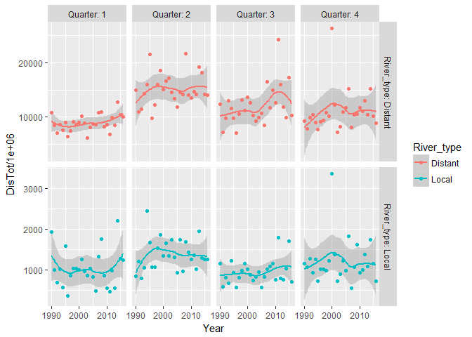<!-- -->

### f. River level: Timing and size of spring flood

```r
df_rivers_springflood_allyears <- df_rivers %>%
  group_by(Station_name, Year) %>%
  mutate(DisTot_max = max(DisTot[Month %in% 1:6]), na.rm = TRUE) %>%
  group_by(Station_name) %>%
  summarize(DisTot_max_mean = mean(DisTot_max, na.rm = TRUE))
df_rivers_springflood_allyears
```

<div data-pagedtable="false">
  <script data-pagedtable-source type="application/json">
{"columns":[{"label":["Station_name"],"name":[1],"type":["chr"],"align":["left"]},{"label":["DisTot_max_mean"],"name":[2],"type":["dbl"],"align":["right"]}],"data":[{"1":"Drammenselva","2":"1455532290"},{"1":"Glomma ved Sarpsfoss","2":"3748959681"},{"1":"Nidelva ovenf. Rygene","2":"570183077"},{"1":"Numedalslågen","2":"507342841"},{"1":"Otra","2":"560263738"},{"1":"Skienselva","2":"1122609913"},{"1":"Storelva v/ Nes verk","2":"43451160"},{"1":"Søndeledelva v. Søndeleddammen","2":"58587352"}],"options":{"columns":{"min":{},"max":[10]},"rows":{"min":[10],"max":[10]},"pages":{}}}
  </script>
</div>

```r
df_rivers_springflood <- df_rivers %>%
  filter(Month %in% 1:6) %>%
  group_by(Station_name, Year) %>%
  mutate(DisTot_max = max(DisTot), na.rm = TRUE) %>%
  group_by(Station_name) %>%
  mutate(DisTot_max_mean = mean(DisTot_max, na.rm = TRUE)) %>%
  ungroup() %>%
  group_by(Station_name, Year) %>%
  summarize(DisTot_max_rel = max(DisTot/DisTot_max_mean*100, na.rm = TRUE),
            DisTot_max_month = Month[DisTot == DisTot_max][1],
            DisTot_40perc = Month[DisTot >= 0.40*DisTot_max_mean][1],
            DisTot_60perc = Month[DisTot >= 0.60*DisTot_max_mean][1],
            DisTot_80perc = Month[DisTot >= 0.80*DisTot_max_mean][1])
```

```
## Warning in max(DisTot/DisTot_max_mean * 100, na.rm = TRUE): no non-missing
## arguments to max; returning -Inf
```


### g1. Plot of max flood

```r
ggplot(df_rivers_springflood, aes(Year, DisTot_max_rel)) +
  geom_smooth() + geom_point() +
  facet_wrap(~Station_name)
```

```
## `geom_smooth()` using method = 'loess'
```

```
## Warning: Removed 1 rows containing non-finite values (stat_smooth).
```

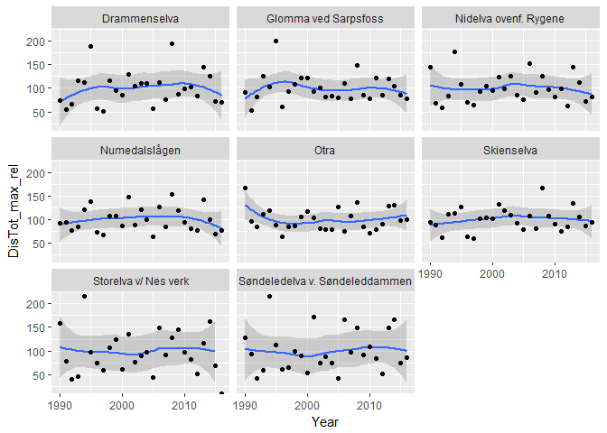<!-- -->

### g2. Plot of flood timing

```r
df_rivers_springflood %>%
  gather("Parameter", "Month", DisTot_max_month, DisTot_40perc, DisTot_60perc, DisTot_80perc) %>%
  ggplot(aes(Year, Month, group = Parameter, color = Parameter)) +
  geom_smooth(method = "lm") + geom_point() +
  facet_wrap(~Station_name)
```

```
## Warning: Removed 80 rows containing non-finite values (stat_smooth).
```

```
## Warning: Removed 80 rows containing missing values (geom_point).
```

<!-- -->


### h. River group level: Timing and size of spring flood

```r
df_rivergroup <- df_rivers %>%
  filter(!Station_name %in% "Otra") %>%
  mutate(River_type = 
           ifelse(substr(Station_name, 1, 4) %in% c("Nide","Sønd","Stor"), "Local", "Distant")) %>%
  group_by(River_type, Year, Month) %>%
  summarize(DisTot = sum(DisTot, na.rm = TRUE))
  
df_rivergroup_springflood_allyears <- df_rivergroup %>%
  group_by(River_type, Year) %>%
  mutate(DisTot_max = max(DisTot[Month %in% 1:6]), na.rm = TRUE) %>%
  group_by(River_type) %>%
  summarize(DisTot_max_mean = mean(DisTot_max, na.rm = TRUE))
df_rivergroup_springflood_allyears
```

<div data-pagedtable="false">
  <script data-pagedtable-source type="application/json">
{"columns":[{"label":["River_type"],"name":[1],"type":["chr"],"align":["left"]},{"label":["DisTot_max_mean"],"name":[2],"type":["dbl"],"align":["right"]}],"data":[{"1":"Distant","2":"6691239143"},{"1":"Local","2":"644590047"}],"options":{"columns":{"min":{},"max":[10]},"rows":{"min":[10],"max":[10]},"pages":{}}}
  </script>
</div>

```r
df_rivergroup_springflood <- df_rivergroup %>%
  filter(Month %in% 1:6) %>%
  group_by(River_type, Year) %>%
  mutate(DisTot_max = max(DisTot), na.rm = TRUE) %>%
  group_by(River_type) %>%
  mutate(DisTot_max_mean = mean(DisTot_max, na.rm = TRUE)) %>%
  ungroup() %>%
  group_by(River_type, Year) %>%
  summarize(DisTot_max_rel = max(DisTot/DisTot_max_mean*100, na.rm = TRUE),
            DisTot_max_month = Month[DisTot == DisTot_max][1],
            DisTot_40perc = Month[DisTot >= 0.40*DisTot_max_mean][1],
            DisTot_60perc = Month[DisTot >= 0.60*DisTot_max_mean][1],
            DisTot_80perc = Month[DisTot >= 0.80*DisTot_max_mean][1])
```

### g1. Plot of max flood

```r
ggplot(df_rivergroup_springflood, aes(Year, DisTot_max_rel)) +
  geom_smooth() + geom_point() +
  facet_wrap(~River_type)
```

```
## `geom_smooth()` using method = 'loess'
```

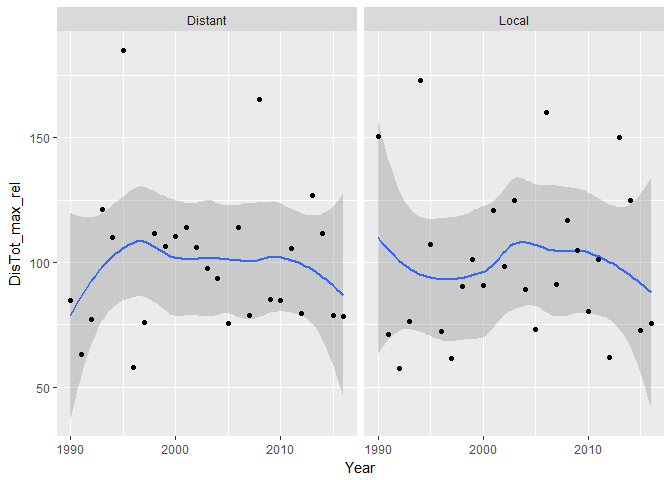<!-- -->

### g2. Plot of flood timing

```r
df_rivergroup_springflood %>%
  gather("Parameter", "Month", DisTot_max_month, DisTot_40perc, DisTot_60perc, DisTot_80perc) %>%
  ggplot(aes(Year, Month, group = Parameter, color = Parameter)) +
  geom_smooth(method = "lm") + 
  geom_jitter(width = 0, height = 0.15) +
  facet_wrap(~River_type)
```

```
## Warning: Removed 20 rows containing non-finite values (stat_smooth).
```

```
## Warning: Removed 20 rows containing missing values (geom_point).
```

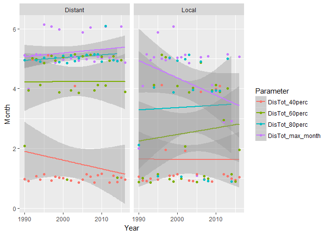<!-- -->


### h. Save all

```r
write.csv(df_rivers_summ_a, "Data_produced/05_df_rivers_summ_a.csv", row.names = FALSE, quote = FALSE)
write.csv(df_rivers_summ_q, "Data_produced/05_df_rivers_summ_q.csv", row.names = FALSE, quote = FALSE)
write.csv(df_rivergroup_springflood, "Data_produced/05_df_rivergroup_springflood.csv", 
          row.names = FALSE, quote = FALSE)
```


## 3. Hydrological data
### a. Read data

```r
load("Datasett/Hydrografi/Arendal_allvars_1990_2016.Rdata")
Df.Arendal$Month <- Df.Arendal$Dato %>% as.character() %>% substr(6,7) %>% as.numeric()
Df.Arendal$Year <- Df.Arendal$Dato %>% as.character() %>% substr(1,4) %>% as.numeric()
Df.Arendal$Time <- ymd_hms(paste(Df.Arendal$Dato, "00:00:00"))   # R's time format
```

### b. Summarize by depth bins and quarter    
    * Depth bins = 0-10, 10-30, 30-50  
    * Quarters starting with February, as with plankton data (section 4c)  
    * For quarters, also see script 04, plot in section 3b  

```r
df <- Df.Arendal %>%
  mutate(
    Depth = case_when(
      Depth %in% c(0,5,10) ~ "Surface",
      Depth %in% c(20,30) ~ "Intermediate",
      Depth %in% c(50,75) ~ "Deep")
    )

df_hydro_summ_a <- df %>%
  group_by(Year, Depth) %>%
  summarize_at(vars(Temperatur:Siktdyp), mean, na.rm = TRUE)

df_hydro_summ_q <- df %>%
  mutate(
    Quarter = case_when(
      Month %in% 1 ~ 4,
      Month %in% 2:4 ~ 1,
      Month %in% 5:7 ~ 2,
      Month %in% 8:10 ~ 3,
      Month %in% 11:12 ~ 4),
    Year2 = case_when(
      Month == 1 ~ Year - 1,
      Month > 1 ~ Year)
    ) %>%
  group_by(Year2, Quarter, Depth) %>%
  summarize_at(vars(Temperatur:Siktdyp), mean, na.rm = TRUE) %>%
  rename(Year = Year2)

df_hydro_summ_a$Depth <- factor(df_hydro_summ_a$Depth, 
                                 levels = c("Surface", "Intermediate", "Deep"))
df_hydro_summ_q$Depth <- factor(df_hydro_summ_q$Depth, 
                                 levels = c("Surface", "Intermediate", "Deep"))
```

### c. Save

```r
write.csv(df_hydro_summ_a, "Data_produced/05_df_hydro_summ_a.csv", row.names = FALSE, quote = FALSE)
write.csv(df_hydro_summ_q, "Data_produced/05_df_hydro_summ_q.csv", row.names = FALSE, quote = FALSE)
```

### d1. Plot temperature, annual

```r
ggplot(df_hydro_summ_a, aes(Year, Temperatur, color = Depth)) +
  geom_smooth(method = "lm") + geom_point()
```

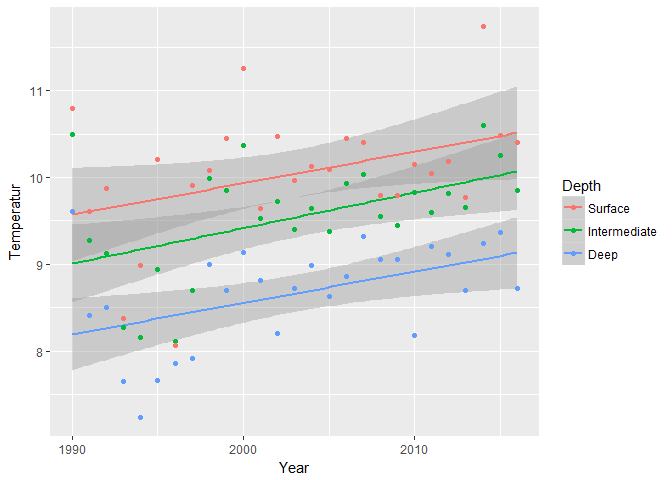<!-- -->

### d2. Plot temperature by quarter

```r
ggplot(df_hydro_summ_q, aes(Year, Temperatur, color = Depth)) +
  geom_smooth(method = "lm") + geom_point() +
  facet_grid(.~Quarter, labeller = label_both)
```

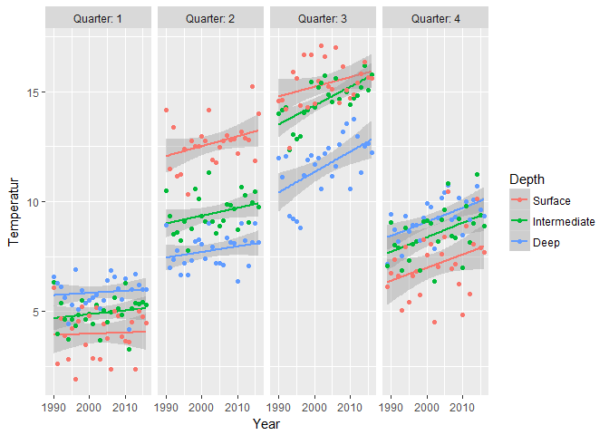<!-- -->

### e. Plot some nutrients etc.

```r
df_hydro_summ_q %>%
  gather("Var", "Concentration", NO2_NO3, TotP, TotN, TSM) %>%
  ggplot(aes(Year, Concentration, color = Depth)) +
    geom_smooth(method = "lm") + geom_point() +
    facet_grid(Var~Quarter, scales = "free_y", labeller = label_both)
```

```
## Warning: Removed 58 rows containing non-finite values (stat_smooth).
```

```
## Warning: Removed 58 rows containing missing values (geom_point).
```

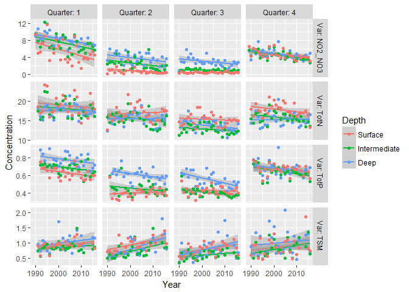<!-- -->

## 4. Plankton  
Summarize main groups only  
    * Will add ordination scores (DCA) later
    
### a. Read plankton data

```r
df_plank <- read_excel("Datasett/Plankton/Planteplankton Arendal.xlsx") # range = "A1:V471"
df_plank$Year <- lubridate::year(df_plank$Dato)
df_plank$Month <- lubridate::month(df_plank$Dato)
```

### b. Plankton: Select by depth  
0-30 or 5 m  

```r
xtabs(~Dyp, df_plank)
```

```
## Dyp
##  0-30 m 0-30 m*     0 m    10 m    20 m    30 m    30 M     5 m      5m 
##     122       1       6       3       2       1       1     322      12
```

```r
# Select
sel <- df_plank$Dyp %in% c("0-30 m", "5 m", "5m"); 
df_plank <- df_plank[sel,]

# Stats
cat("Select", sum(sel), "lines\n")
```

```
## Select 456 lines
```

```r
cat(mean(sel)*100, "% of the data")
```

```
## 97.02128 % of the data
```

### c. Summarize data  
As hydrological data (section 3b), use quarters starting with February (see script 04, plot in section 3b) 

```r
df_plank_summ_a <- df_plank %>%
  mutate(Total = Kiselalger + Dinoflagellater + Flagellater) %>%
  group_by(Year) %>%
  summarize_at(.vars = vars(Kiselalger:Flagellater, Total), 
               .funs = funs(med = median, max = max)
               )

df_plank_summ_q <- df_plank %>%
  mutate(
    Quarter = case_when(
      Month %in% 1 ~ 4,
      Month %in% 2:4 ~ 1,
      Month %in% 5:7 ~ 2,
      Month %in% 8:10 ~ 3,
      Month %in% 11:12 ~ 4),
    Year2 = case_when(
      Month == 1 ~ Year - 1,
      Month > 1 ~ Year),
    Total = Kiselalger + Dinoflagellater + Flagellater
    ) %>%
  group_by(Year2, Quarter) %>%
  summarize_at(.vars = vars(Kiselalger:Flagellater, Total), 
               .funs = funs(med = median, max = max)
               ) %>%
  rename(Year = Year2)
```

### d. Save

```r
write.csv(df_plank_summ_a, "Data_produced/05_df_plank_summ_a.csv", row.names = FALSE, quote = FALSE)
write.csv(df_plank_summ_q, "Data_produced/05_df_plank_summ_q.csv", row.names = FALSE, quote = FALSE)
```


### e1. Plot medians by year

```r
df_plank_summ_q %>%
  gather("Group", "Median", Kiselalger_med:Total_med) %>%
  ggplot(aes(Year, Median/1E6)) +
    geom_smooth(method = "lm") + geom_point() +
    facet_grid(Group~., scales = "free_y")
```

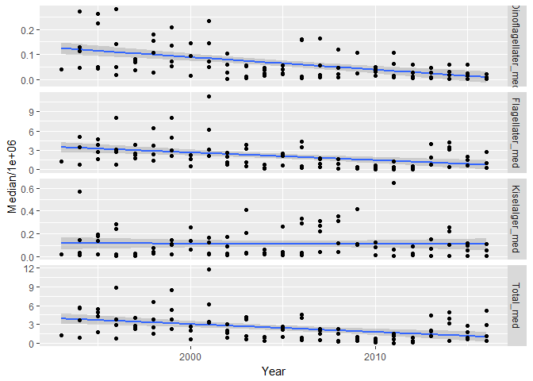<!-- -->


### e2. Plot medians by quarter

```r
df_plank_summ_q %>%
  gather("Group", "Median", Kiselalger_med:Total_med) %>%
  mutate(Quarter = paste("Quarter", Quarter)) %>%
  ggplot(aes(Year, Median/1E6)) +
    geom_smooth(method = "lm") + geom_point() +
    facet_grid(Group~Quarter, scales = "free_y")
```

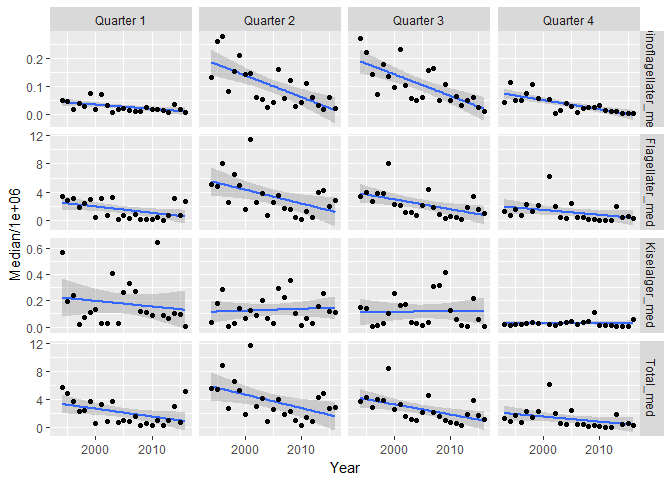<!-- -->
### f. Plot maxima

```r
df_plank_summ_q %>%
  gather("Group", "Maximum", Kiselalger_max:Total_max) %>%
  mutate(Quarter = paste("Quarter", Quarter)) %>%
  ggplot(aes(Year, Maximum/1E6)) +
    geom_smooth(method = "lm") + geom_point() +
    facet_grid(Group~Quarter, scales = "free_y")
```

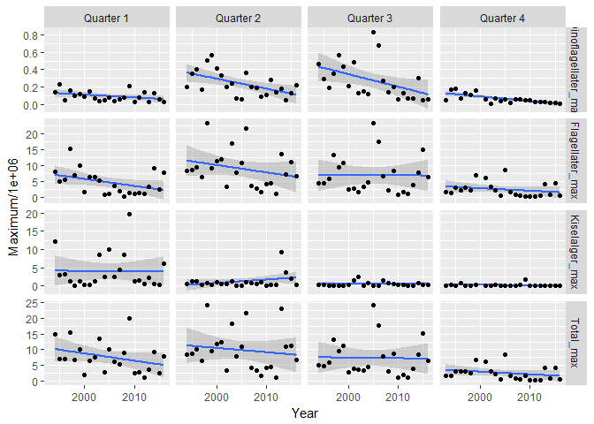<!-- -->


